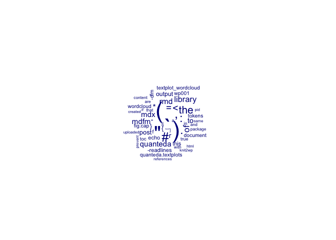
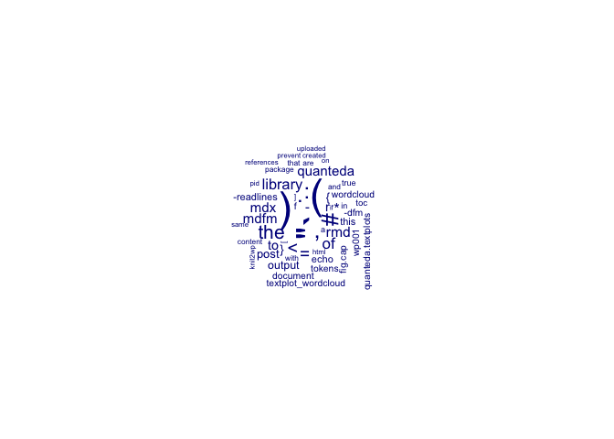
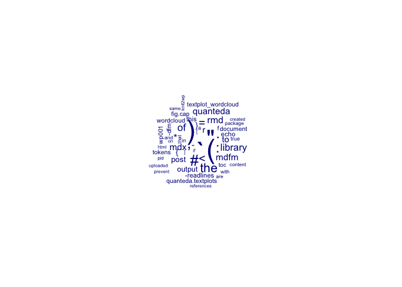
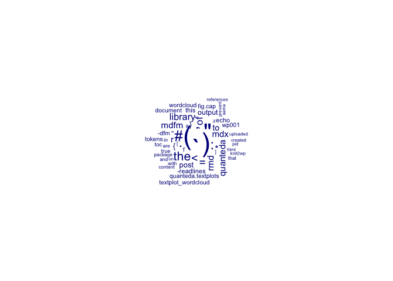
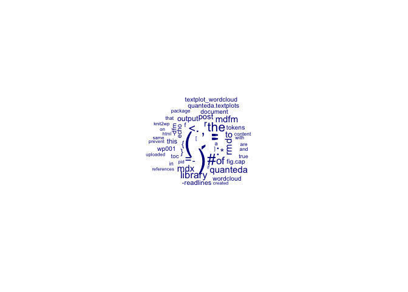

<div id="2095-top-1"><style>.backtop a{font-size:24px;text-decoration:none;}</style></div>


-   [1 pub essai R to WP](#2095-pub-essai-r-to-wp)
    -   [1.1 snc](#2095-snc)
    -   [1.2 workaround](#2095-workaround)
    -   [1.3 persistent solution](#2095-persistent-solution)
    -   [1.4 R package](#2095-r-package)
    -   [1.5 issues](#2095-issues)
        -   [1.5.1 14045.](#2095-section)
    -   [1.6 versions](#2095-versions)
        -   [1.6.1 14037.v0.1.5](#2095-v0.1.5)
-   [2 B: references](#2095-b-references)

# 1 pub essai R to WP {id="2095-pub-essai-r-to-wp"}

publishing using R package *duncantl/RWordPress* (Lang 2023) wks half: the pandoc citation features and footnotes which are generated by the *knit2wp()*-function of the *knitr* package (Yihui 2024) are not correctly converted to the post html.

## 1.1 snc <a class="backtop" href="#2095-top-1">&#8682;</a> {id="2095-snc"}

1.  knitXwp lib installed on mini.2:post wt lib,apply.css,uniquecss id,chk,toc,img1

## 1.2 workaround <a class="backtop" href="#2095-top-1">&#8682;</a> {id="2095-workaround"}

``` r
library(markdown)
library(rmarkdown)
pid<-0 # set postID of post created with knit2wp() or any existing post
rmd<-"sample.Rmd" # path of the R-Markdown file
wp.knit.post<-function(rmd,pid){
render(rmd) # renders the .Rmd according to the parameters specified in the YAML header of the .Rmd
md.ns<-gsub("\\.Rmd",".md",rmd)
p.content<-readLines(md.ns)
p.html<-mark(p.content) # renders the created .md file
editPost(pid,content = p.html) # actualises post content
}
```

script to create html content of post

    ---
    title: "14022"
    author: "xxx"
    date: "2024-01-08"
    output: 
      md_document:
       variant: markdown_phpextra+backtick_code_blocks
       toc: true
       number_sections: true
       pandoc_args: ["--wrap=none"]
    bibliography: sample.bib
    ---

yaml-header of the .Rmd rendered

## 1.3 persistent solution <a class="backtop" href="#2095-top-1">&#8682;</a> {id="2095-persistent-solution"}

modified the content of the *knit2wp()* function as to use *render()* and *mark()* instead of *knit()* and *markdownToHTML()*. now works.

## 1.4 R package <a class="backtop" href="#2095-top-1">&#8682;</a> {id="2095-r-package"}

wrote small R package that does the same: <https://github.com/esteeschwarz/knitXwp>

## 1.5 issues <a class="backtop" href="#2095-top-1">&#8682;</a> {id="2095-issues"}

### 1.5.1 14045. <a class="backtop" href="#2095-top-1">&#8682;</a> {id="2095-section"}

-   if there are images in the post: they are uploaded, but not overwritten on the server, if uploaded again in case you actualise the post. that means for every post action a new image on the server is created with a trailing increasing number. this is a wordpress feature to prevent overwrite uploaded files with the same name.
-   tweaking in the wordpress functions to prevent that, had no success. so i will integrate a function which allows deleting old instances of images if you decide for that.

#### 1.5.1.1 play along image references <a class="backtop" href="#2095-top-1">&#8682;</a> {id="2095-play-along-image-references"}

<figure>

<figcaption aria-hidden="true">quanteda wordcloud output of this document</figcaption>
</figure>

<figure>

<figcaption aria-hidden="true">quanteda wordcloud output of this document</figcaption>
</figure>

<figure>

<figcaption aria-hidden="true">quanteda wordcloud output of this document</figcaption>
</figure>

<figure>

<figcaption aria-hidden="true">quanteda wordcloud output of this document</figcaption>
</figure>

<figure>

<figcaption aria-hidden="true">quanteda wordcloud output of this document</figcaption>
</figure>

<figure>

<figcaption aria-hidden="true">quanteda wordcloud output of this document</figcaption>
</figure>

<figure>

<figcaption aria-hidden="true">quanteda wordcloud output of this document</figcaption>
</figure>

## 1.6 versions <a class="backtop" href="#2095-top-1">&#8682;</a> {id="2095-versions"}

### 1.6.1 14037.v0.1.5 <a class="backtop" href="#2095-top-1">&#8682;</a> {id="2095-v0.1.5"}

-   its now possible to apply a stylesheet to the html output of the post container in the blog.
-   prevent toc entry jumping across different post with possible same toc entries (references, method), added unique id to all section headers and toc entries
-   add back-to-top button to section headers to jump back to outline from there

------------------------------------------------------------------------

# 2 B: references <a class="backtop" href="#2095-top-1">&#8682;</a> {id="2095-b-references"}

<div id="refs" class="references csl-bib-body hanging-indent" markdown="1">

<div id="ref-lang_duncantlrwordpress_2023" class="csl-entry" markdown="1">

Lang, Duncan Temple. 2023. “Duncantl/RWordPress.” <https://github.com/duncantl/RWordPress>.

</div>

<div id="ref-yihui_knitr_2024" class="csl-entry" markdown="1">

Yihui, Xie. 2024. “Knitr - Yihui Xie 谢益辉.” <https://yihui.org/knitr/>.

</div>

</div>
